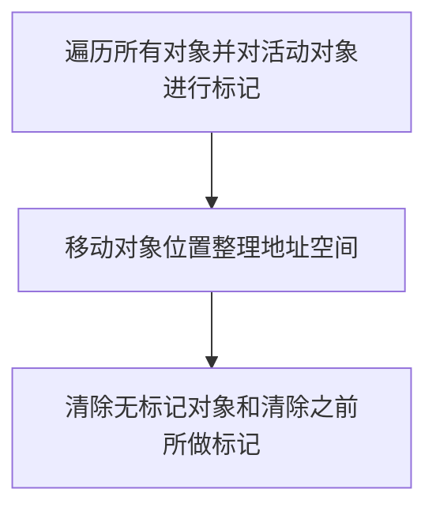
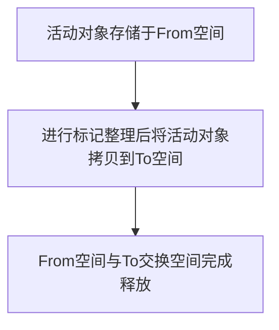

# 吴智翀 | Part1模块二

## 简答题


### 第一题:描述引用计数算法的工作原理和优缺点。

工作原理：设置了引用计数器，记录对象的引用数，当对象的引用关系发生变化时就去修改引用数，当引用数为0时会认为是垃圾，就会**`立即`**进行垃圾回收♻️并释放空间。

优点：

- 发现垃圾时会立即进行回收，实时性强
- 分布于整个程序运行期间，很平滑，不需要特意挂起程序来做垃圾回收，减少程序暂停。

缺点：

- 无法处理循环引用对象

- 时间开销较大


### 第二题:描述标记整理算法的工作流程。

分为标记阶段和清除阶段 二个阶段完成。




### 第三题: 描述V8中新生代存储区垃圾回收流程。

新生代内存区分为使用空间From，空间空间To 等大小空间




### 第四题: 描述增量标记算法在何时使用以及工作原理。


老生代区域垃圾回收不适合复制算法，使用增量标记算法优化效率。


原理：

垃圾回收时 会 阻塞JS程序执行。 

增量标记算法 是指 将一整段垃圾回收操作拆分成多个小步，组合完成整个回收操作，替代之前的整段长时间垃圾回收操作。实现垃圾回收和程序执行交替执行 而不是 长时间阻塞程序执行。

将整段垃圾回收时间 切成了多段 时间极短 用户几乎感知不到 不会有程序卡顿阻塞的感觉。


## 代码题1

基于以下代码完成下面练习

```js
const fp = require('lodash/fp');

// horsepower马力, dollar_value价格, in_stock库存

const cars = [
	{
		name: "Ferrari FF",
		horsepower: 660,
		dollar_value: 700000,
		in_stock: true
	},
	{
		name: "Spyker C12 Zagato",
		horsepower: 650,
		dollar_value: 684000,
		in_stock: false
	},
	{
		name: "Jaguar XKR-S",
		horsepower: 550,
		dollar_value: 132000,
		in_stock: false
	},
	{
		name: "Audi R8",
		horsepower: 525,
		dollar_value: 114200,
		in_stock: false
	},
	{
		name: "Aston Martin One-77",
		horsepower: 750,
		dollar_value: 1850000,
		in_stock: true
	},
	{
		name: "Pagani Huayra",
		horsepower: 700,
		dollar_value: 1300000,
		in_stock: false
	},
]
```

### 练习1

使用函数组合fp.flowRight() 实现下面函数

```js
let isLastInStock = function (cars) {
	let last_car = fp.last(cars);
	return fp.prop('in_stock', last_car);
}
```

解答:

```js
const islastInStock = fp.flowRight(fp.prop('in_stock'), fp.last);
```


### 练习2

使用 fp.flowRight(), fp.prop() 和 fp.first() 获取第一个 car 的 name

解答:

```js
const firstCarName = fp.flowRight(fp.prop('name'), fp.first);
```


### 练习3

使用帮助函数 _average 重构 averageDollarValue ，使用函数组合的方式实现

```js
let _average = function (xs) {
	return fp.reduce(fp.add, 0, xs) / xs.length;
}

let averageDollarValue = function (cars) {
	let dollar_values = fp.map(function (car) {
		return car.dollar_value
	}, cars);
	return _average(dollar_values)
}
```

解答:

```js
const averageDollarValue = fp.flowRight(_average,fp.map(car=>car.dollar_value))
```


### 练习4

使用 flowRight 写一个 sanitizeNames() 函数，返回一个下划线连接的小写字符串，把数组中的 name 转换为这种形式：例如：sanitizeNames(["Hello World"]) => ["hello_world"]

```js
let _underscore = fp.replace(/\W+/g, '_'); // 无需改动，并在 sanitizeNames 中使用它
```

解答:

```js
const sanitizeNames = fp.map(fp.flowRight(_underscore, fp.lowerCase))
```


## 代码题2

基于下面提供的代码，完成后续练习

```js
class Container {
    static of (value) {
        return new Container(value);
    }
    constructor (value) {
        this._value = value;
    }
    map (fn) {
        return Container.of(fn(this._value));
    }
}

class Maybe {
    static of (x) {
        return new Maybe(x);
    }
    isNothing () {
        return this._value === null || this._value === undefined;
    }
    constructor (x) {
        this._value = x;
    }
    map (fn) {
        return this.isNothing() ? this : Maybe.of(fn(this._value));
    }
}

module.exports = {
    Maybe,
    Container
}
```


### 练习1

使用 fp.add(x, y) 和 fp.map(f, x) 创建一个能让 functor 里的值增加的函数 ex1

```js
const fp = require('lodash/fp');
const { Maybe, Container } = require('./support.js');

let maybe = Maybe.of([5, 6, 1]);
// let ex1 = // ... 你需要实现的位置
```

解答:

```js
let maybe = Maybe.of([5, 6, 1]);
let ex1 = addNum => fp.map(x=>fp.add(addNum,x))
console.log(maybe.map(ex1(2))) //每项加2
//Maybe { _value: [ 7, 8, 3 ] }
```


### 练习2

实现一个函数 ex2，能够使用 fp.first 获取列表的第一个元素

```js
const fp = require('lodash/fp');
const { Maybe, Container } = require('./support.js');

let xs = Container.of(['do', 'ray', 'me', 'fa', 'so', 'la', 'ti', 'do']);
// let ex2 = // ... 你需要实现的位置
```

解答:

```js
let xs = Container.of(['do','ray','me','fa','so','la','ti','do'])

let ex2 = (listContainer)=>listContainer.map(fp.first)._value

console.log(ex2(xs));
//do
```


### 练习3

实现一个函数 ex3 ，使用 safeProp 和 fp.first 找到 user 的名字的首字母

```js
const fp = require('lodash/fp');
const { Maybe, Container } = require('./support.js');

let safeProp = fp.curry(function (x, o) {
    return Maybe.of(o[x]);
});
let user = { id: 2, name: 'Albert' };
// let ex3 = // ... 你需要实现的位置
```

解答

```js
let user = { id: 2, name: 'Albert' };
let ex3 = user => {
	return safeProp('name',user).map(x=>fp.first(x))._value
}
console.log('首字母',ex3(user))
//首字母 A
```


### 练习4

使用 Maybe 重写 ex4 ，不要有 if 语句

```js
const fp = require('lodash/fp');
const { Maybe, Container } = require('./support.js');

let ex4 = function (n) {
    if (n) {
        return parseInt(n)
    }
}
```

解答

```js
let ex4 = n => (Maybe.of(n||undefined).map(parseInt))._value
console.log('ex4',ex4plus(0));
// ex4 undefined
```

