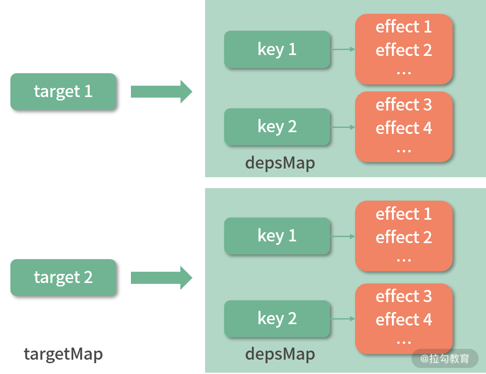
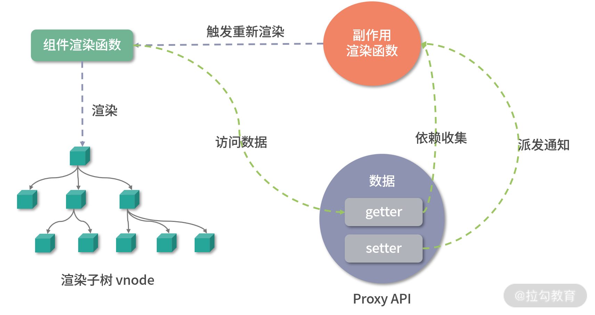

> **Vue3** <font style="color:white;background:#F12F28;padding:3px 6px;font-weight:bold;line-height:28px">响应式系统</font>
>
> - proxy对象实现属性监听，初始化时不需遍历所有属性
> - 多层属性嵌套，访问某属性时才会递归处理下一级属性
> - 默认监听属性的动态添加
> - 默认监听属性的删除操作
> - 默认监听数组索引和length属性
> - 可引入作为单独的模块使用

- 未改变原对象(不同于defineProperty)，只是用proxy包装原对象

- 避免不了vue2的频繁触发getter|setter的问题，甚至更频繁，因为还监听了一些自身属性如length，所以仍然需要重写数组的7个方法`push | pop | shift | unshiift | splice | sort | reverse`

- 对象深层属性变化可以监听到，但是只能触发第一层的getter|setter，多层嵌套的后面层未触发


⚠️ <font style="color:yellow;background:mediumseagreen;padding:2px 4px;font-weight:bold;line-height:25px">reactive 和 ref 内部实现都触发了 依赖收集track和触发更新trigger </font>

## 响应式 <font style="color:white;background:mediumseagreen;padding:3px 6px;font-weight:bold;line-height:28px">proxy</font>


```js
const target = {
    foo: 'xx',
    bar: 'yy'
}

// 建议使用Reflect 语义更统一 proxy能使用的handler在Reflect上都能找到相应方法

const proxy = new Proxy(target, {
    get(target,key,receiver) {
        // target[key]
        return Reflect.get(target,key,receiver)
    },
    set(target,key,value,receiver) {
        // target[key] = value
        return Reflect.set(target,key,value,receiver)
    },
    deleteProperty(target,key) {
        return Reflect.deleteProperty(target,key)
    }
})

# set和deleteProperty加上 return 是因为在严格模式下 若返回false是会报错的 
# 而若不加上return 则函数会返回 undefined 必定引起报错
```


`receiver` 是指当前创建的Proxy对象或者继承自Proxy的子对象

如果target对象中设置了 getter，getter中的 `this` 会指向 `receiver`


**<u>实现</u>**

```js
const obj = {
    a: 1,
    get foo() {
        console.log(this)
        return this.bar
    }
}

const proxy = new Proxy(obj, {
    get(target,key) {
        if(key === 'bar'){
            return 'value: bar'
        }
        return target[key]
    }
})
console.log(proxy.foo)
// 输出的是 
{a:1,foo:undefined}
undefined   

const proxy2 = new Proxy(obj, {
    get(target, key, receiver) {
        if(key === 'bar') {
            return 'value: bar'
        }
        return Reflect.get(target, key, receiver)
    }
})
console.log(proxy2.foo)
// 输出的是
Proxy {a: 1, foo: undefined}
value: bar
```

<font color=dodgerblue style="font-weight:bold">这打印proxy.foo时，this指向的是obj对象；在打印proxy2.foo时，通过receiver来了个偷梁换柱，this指向了当前的Proxy对象，那么自然就触发了proxy中的getter打印出了key为bar时的值，这就是receiver的妙用</font>

`getter和Reflect中都需要带上receiver参数方可`


## 响应式 <font style="color:white;background:mediumseagreen;padding:3px 6px;font-weight:bold;line-height:28px">reactive</font>

- 接受一个参数，判断该参数是否是对象，如果不是对象直接返回原始值(例如原始类型数据)，可传入数组
- 创建拦截器handler，设置get/set/deletePropery
- 返回Proxy对象(包装为了响应式数据)


实现如下

```js
const isObject = obj => obj !== null && typeof obj === 'object'
const convert = target => isObject(target) ? reactive(target) : target
const hasOwnProperty = Object.prototype.hasOwnProperty
// 将内部的this改变为了target
const hasOwn = (target,key) => hasOwnProperty.call(target,key)

function reactive(target) {
	if(!isObject(target)) return target

	const handler = {
		get (target, key, receiver) {
			// TODO: 收集依赖
			console.log('get', key)
			// 若key也为对象 需要递归处理下
			const result = Reflect.get(target, key, receiver)
			// 若result也为对象 还需要再次递归调用来处理
			return convert(result)
			// 或者
			/* if (isObject(result)) {
				return reactive(result)
			} else {
				return result
			} */
		},
		set (target, key, value, receiver) {
			const OLD_VALUE = Reflect.get(target,key,receiver)
			let result = true
			if(OLD_VALUE !== value) {
				result = Reflect.set(target, key, value, receiver)
				// TODO: 触发更新
				console.log('set',key,value)
			}
			return result
		},
		deleteProperty(target, key) {
			const hasKey = hasOwn(target,key)
			const result = Reflect.deleteProperty(target, key)
			if (hasKey && result) {
				// TODO: 触发更新
				console.log('delete',key)
			}
			return result
		}
	}
	return new Proxy(target, handler)
}
```


## 响应式 <font style="color:white;background:mediumseagreen;padding:3px 6px;font-weight:bold;line-height:28px">收集依赖</font>


```js
import {reeactive,eeffect} from '@vue/reactivity'

const product = reactive({
    name: 'iPhone',
    price: 5000,
    count: 3
})

let total = 0

// 依赖收集 触发更新
effect(()=>{
    total = product.price * product.count
})
console.log(total)

product.price = 4000
console.log(total)

product.count = 2
console.log(total)

```


| 集合                                                 | 数据结构 |
| ---------------------------------------------------- | :------: |
| targetMap(记录目标对象target和对应字典depsMap)弱引用 | WeakMap  |
| depsMap(记录目标对象属性名称和对应集合dep)           |   Map    |
| dep(记录effect函数)                                  |   Set    |


## 响应式 <font style="color:white;background:mediumseagreen;padding:3px 6px;font-weight:bold;line-height:28px">effect | track</font>

`effect` 为副作用函数

会调用作为参数的函数，初始化时会调用一下


`track` 为收集依赖函数  其中涉及三种数据结构

| 集合                                                 | 数据结构 |
| ---------------------------------------------------- | :------: |
| targetMap(记录目标对象target和对应字典depsMap)弱引用 | WeakMap  |
| depsMap(记录目标对象属性名称和对应集合dep)           |   Map    |
| dep(记录effect函数)                                  |   Set    |




**<u>实现</u>** `effect` | `track`

```js
let activeEffect = null
function effect(callback) {
	activeEffect = callback
	// 先执行一次callback
	callback() //访问响应式对象属性，去收集依赖
	activeEffect = null // 依赖收集完毕 设置为null
}

// track收集依赖
let targetMap = new WeakMap()
function track (target, key) {
	if (!activeEffect) {
		// 没有要收集的依赖
		return
	}
	let depsMap = targetMap.get(target)
	if (!depsMap) {
		// depsMap若为空则创建一个Map 并赋给depsMap
		targetMap.set(target,(depsMap = new Map()))
	}
	let dep = depsMap.get(key)
	if (!dep) {
		depsMap.set(key,(dep = new Set()))
	}
	// 将回调函数添加到dep中
	dep.add(activeEffect)
}
```


## 响应式 <font style="color:white;background:mediumseagreen;padding:3px 6px;font-weight:bold;line-height:28px">trigger</font>

`trigger` 为派发通知(触发更新)函数

遍历dep中的effect函数，一个个调用


**<u>实现</u>**

```js
function trigger(target, key) {
	const depsMap = targetMap.get(target)
	if (!depsMap) {
		return
	}
	const dep = depsMap.get(key)
	if (dep) {
		// 若dep集合不为空 则调用其中的额每个effect函数
		dep.forEach(effect => {
			console.log('调用effect函数',effect)
			effect()
		})
	}
}
```


> `effect` | `track` | `trigger` 函数比较底层 一般是内部使用 不会直接调用


## 响应式 <font style="color:white;background:mediumseagreen;padding:3px 6px;font-weight:bold;line-height:28px">ref</font>

`前置知识`

```js
var a = {
    originVal: 'bar', 
    get foo(){
        console.log('get')
        return this.originVal
    },
    set foo(newVal){
        console.log('set')
        this.originVal = newVal
    }
}

a.foo // get bar
a.foo = 'new-bar' // set
a.foo // get new-bar

# 切莫和Proxy中的handler对象中的 get | set 方法弄混了

var aProxy = new Proxy(a, {
    get(target,key,receiver){},
    set(target,key,value,receiver){}
})
```

⚠️ 重点是 对象中的 ***__v_isRef*** 标记 和 getter setter


**<u>实现</u>**

```js
const isObject = obj => obj !== null && typeof obj === 'object'

const convert = target => isObject(target) ? reactive(target) : target

function ref(raw) {
	// 判断参数raw 是不是ref创建的对象 如果是则直接返回
	if (isObject(raw) && raw.__v_isRef) {
		return
	}
	// 若是对象 则转换为响应式对象
	let value = convert(raw)
	const r = {
		__v_isRef: true,
		get value() {
			track(r,'value')
			return value
		},
		set value(newVal) {
			if (newVal !== value) {
				raw = newVal

				value = convert(raw)
				// 触发更新
				trigger(r, 'value')
			}
		},
	}
}
```


##  `reactive` V.S. `ref`

- ref可以把基本数据类型，转换为响应式对象
- ref返回的对象，重新赋值成对象也是响应式的 (setter还做了一层convert处理)
- reactive返回的对象，(把返回对象)直接重新赋值会丢失响应式 (setter未再做convert处理)
- reactive 返回的对象不可以解构


## 响应式 <font style="color:white;background:mediumseagreen;padding:3px 6px;font-weight:bold;line-height:28px">toRefs</font>

顾名思义，将传入的reactive对象的所有属性转换为类似ref(xxx)后的 对象


**<u>实现</u>**

```js
function toProxyRef(proxy, key) {
 const r = {
  __v_isRef: true,
  get value() {
   // 不需要此处额外收集依赖
   return proxy[key]
  },
  set value(newVal) {
   proxy[key] = newVal
  }
 }
}

function toRefs(proxy) {
 const ret = proxy instanceof Array ? new Array(proxy.length) : {}

 for (const key in proxy) {
  ret[key] = toProxyRef(proxy,key)
 }

 return ret
}
```


## 响应式 <font style="color:white;background:mediumseagreen;padding:3px 6px;font-weight:bold;line-height:28px">computed</font>

> 内部是通过effect来实现的

**<u>实现</u>**

```js
function computed(getter) {
	const result = ref() //不传参默认传入undefined
	
	effect(() => (result.value = getter()))
	return result
}
```


<font style="color:white;background:#F12F28;padding:3px 6px;font-weight:bold;line-height:28px">原理</font>

响应式系统的最原始需求即 ***我们修改了数据就希望能自动执行某个函数***

我们的目的是实现响应式，就是当数据变化的时候可以自动做一些事情，比如执行某些函数，所以我们收集的依赖就是数据变化后执行的副作用函数。


源码学习分析：

http://shymean.com/article/Vue3%E6%BA%90%E7%A0%81%E8%A7%A3%E6%9E%90%E2%80%94%E2%80%94%E6%95%B4%E4%BD%93%E6%B5%81%E7%A8%8B%E5%92%8C%E7%BB%84%E5%90%88%E5%BC%8FAPI


<font style="color:white;background:#F12F28;padding:3px 6px;font-weight:bold;line-height:28px">一图镇</font>




首次渲染核心`setupRenderEffect`

`setupRenderEffect`，主要是实现`instance.update`方法，该方法等价于`effect(function componentEffect(){...})`


- 由于没有传入`option.lazy`配置，在`effect(componentEffect)`初始化时会调用一次`componentEffect`，这样就可以执行effect，从而完成页面的初始化mount

  将componentEffect赋值给全局activeEffect

- 在`patch`的时候，会运行`render`函数渲染视图，从而触发相关数据的getter，然后track当前的`componentEffect`；当状态变化时，会重新trigger `componentEffect`

- 其配置的scheduler为`queueJob`，因此每次trigger触发effect run时，会通过queueJob将effect放入queue全局队列中等待nextTick运行，因此多个状态的改变会合并在一起进行视图更新


render触发getter例子🌰 (vue2)

```js
tempalte:
    <div id="app">
        {{message}}
    </div>
    
render:
    // 执行render， 需要读取响应式属性message，触发message的getter方法
    (function anonymous() {
        with(this){return _c('div',{attrs:{"id":"app"}},[_v(_s(message))])}
    })
    // _s, 将this.message转化为字符串
    // _v, 生成文本节点对应的VNode
    // _c, 生成'div'元素节点对应的Vnode
```

